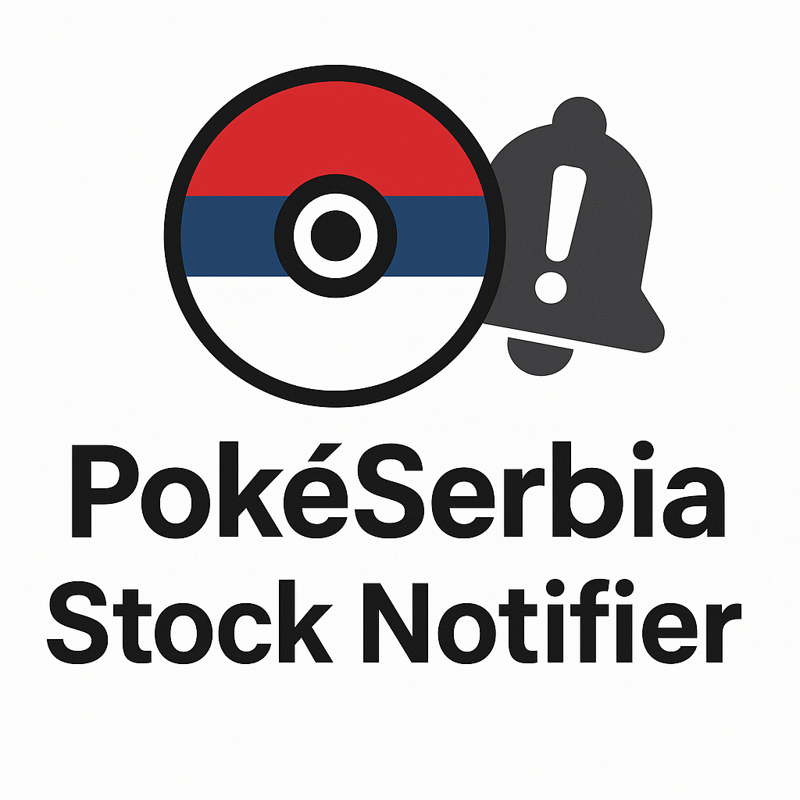

    

<h1 align="center">
    PokéSerbia TCG Stock Notifier
</h1>

    A self-hosted Discord bot that scrapes Serbian online stores for new Pokémon TCG products and provides real-time, configurable notifications.
     
     
    <a href="https://github.com/Numulix/ptcg-scraper-discord-bot/issues">Report Bug</a>
    ·
    <a href="https://github.com/Numulix/ptcg-scraper-discord-bot/issues">Request Feature</a>
    

    
    
    

## About this project

This project was born out of a passion for Pokémon TCG and the challenge of keeping up with new product releases across various Serbian retailers. This bot automates the process of checking for new stock by periodically scraping store websites and instantly notifying a designated Discord channel when a new item is found.

Currently, it supports scraping from the following stores:
- [Delfi](https://delfi.rs/)

Scrapers that have yet to be implemented:
- [Kraken](https://www.kraken.rs/)
- [Games4You](https://games4you.rs/)
- Games.rs
- (easily extendible for more stores)

## Key Features

- **⚙️ Automated Hourly Scraping**: A cron job runs every hour to check for new products.
- **🌐 Dynamic Website Support**: Uses Playwright to handle modern, JavaScript-heavy websites that simple HTTP requests cannot scrape.
- **👋 Automatic Server Setup**: When added to a new server, the bot posts a welcome message and creates a custom role for notifications.
- **🏷️ Reaction Roles**: Users can easily self-assign a TCG Notifier role by reacting to the welcome message, ensuring only interested members are pinged.
- **📢 Configurable Notification Channel**: Server admins can use the `/register` command to choose exactly where announcements are sent.
- **🎯 Targeted Pinging**: Notifications are configured to ping the self-assigned role, respecting users who don't wish to be notified.
- **🐳 Dockerized Deployment**: The entire application is containerized for easy, reliable, and consistent deployment.
- **🧩 Modular Scraper Design**: Thanks to an abstract Scraper class, adding a new store is as simple as creating a new class file.
- **💿 Persistent State**: Remembers the last known products for each store to accurately detect only new items.

## Built With

This project leverages a modern TypeScript and Node.js stack:
- [Node.js](https://nodejs.org/)
- [TypeScript](https://www.typescriptlang.org/)
- [discordx](https://discordx.js.org/)
- [Playwright](https://playwright.dev/)
- [Pino](https://getpino.io/) (for structured logging)
- [Cheerio](https://cheerio.js.org/)
- [node-cron](https://github.com/kelektiv/node-cron)
- [Docker](https://www.docker.com/)